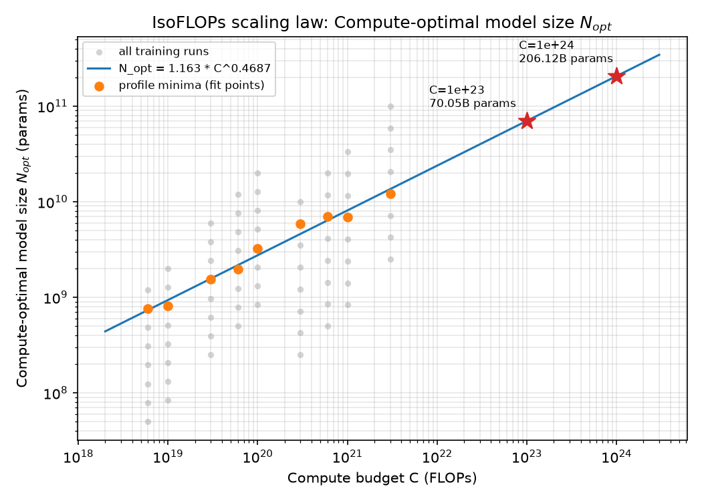
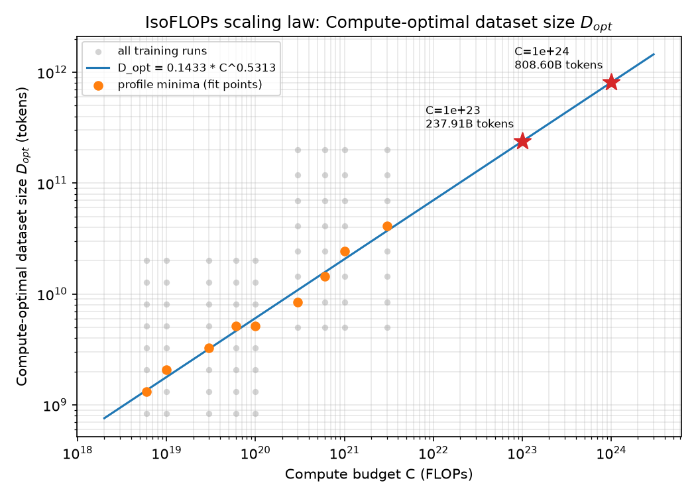
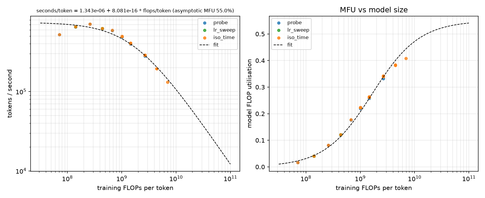
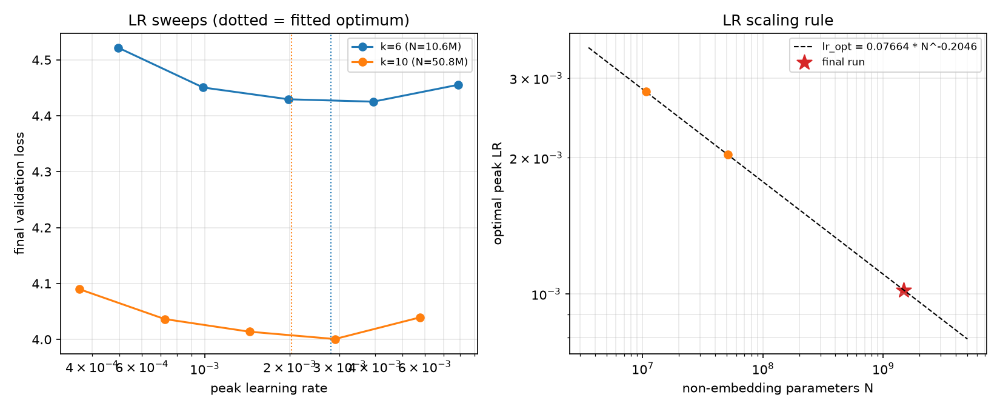
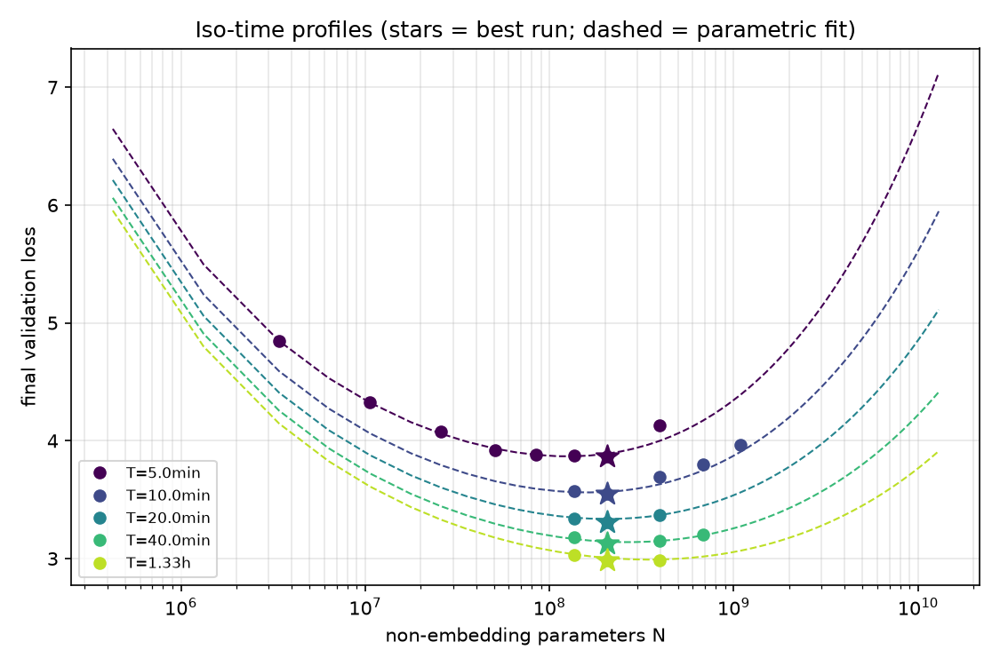
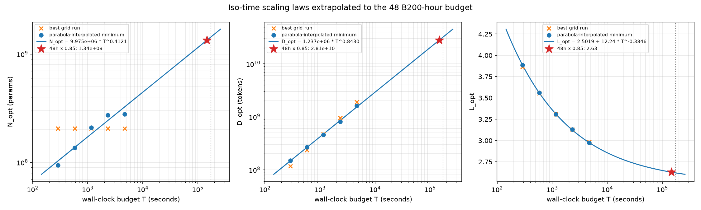
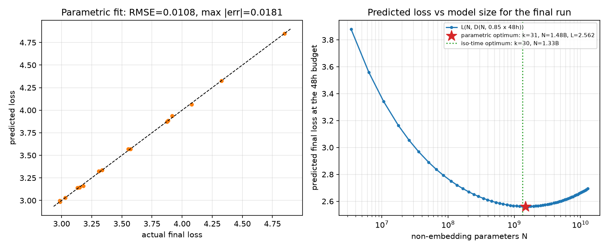

# CS336 Assignment 3 (Scaling) — Write-up

> **Provenance.** This write-up was produced outside the course by a non-student. Problem 1 uses
> the real data shipped with the assignment (`data/isoflops_curves.json`). Problem 2 requires the
> hosted training API, which is only reachable from the Stanford network with a student API key;
> the complete pipeline is implemented against the API's interface and **all Problem 2 numbers below
> come from the built-in offline simulator** (`--backend simulated`), which replaces the API with a
> synthetic model of loss and throughput. The same commands run unchanged against the real API with
> `--backend api`. The code lives in `cs336_scaling/scaling_laws/`; see the README for commands.

---

## 1. Problem `chinchilla_isoflops` — IsoFLOPs scaling laws (5 points)

### Method

`cs336_scaling/scaling_laws/isoflops.py` (`uv run scripts/chinchilla_isoflops.py`):

1. Group the 72 runs by compute budget `C_i` (9 IsoFLOPs profiles of 8 runs each).
2. Following the handout's recommendation, take the run with the lowest final loss in each profile
   as `N_opt(C_i)` (rather than fitting a parabola to each profile), and set
   `D_opt(C_i) = C_i / (6 N_opt(C_i))` from `C = 6ND`.
3. Fit `N_opt = k_N C^a` and `D_opt = k_D C^b` by ordinary least squares in log–log space
   (`fit_power_law`). Fitting in log space weights relative errors equally across the three orders of
   magnitude spanned by `C`, which is the standard choice (Kaplan et al. 2020; Hoffmann et al. 2022).
   Because `D_opt = C/(6N_opt)` exactly, the two exponents satisfy `a + b = 1` by construction.
4. Extrapolate to `1e23` and `1e24` FLOPs.

### Profile minima used for the fit

| `C` (FLOPs) | `N_opt` | `D_opt` (tokens) | loss |
|---|---|---|---|
| 6.0e18 | 7.62e8 | 1.31e9 | 5.900 |
| 1.0e19 | 8.07e8 | 2.07e9 | 5.618 |
| 3.0e19 | 1.54e9 | 3.25e9 | 5.107 |
| 6.0e19 | 1.95e9 | 5.12e9 | 4.831 |
| 1.0e20 | 3.25e9 | 5.12e9 | 4.653 |
| 3.0e20 | 5.90e9 | 8.47e9 | 4.311 |
| 6.0e20 | 6.97e9 | 1.43e10 | 4.121 |
| 1.0e21 | 6.86e9 | 2.43e10 | 4.003 |
| 3.0e21 | 1.22e10 | 4.12e10 | 3.773 |

### Fitted laws

- **Model size:** `N_opt = 1.163 · C^0.4687` (log-space R² = 0.979)
- **Dataset size:** `D_opt = 0.1433 · C^0.5313` (log-space R² = 0.983)

The exponents (0.47 / 0.53) are close to Chinchilla's approach-2 values (0.49 / 0.51): model and data
should be scaled roughly equally with compute.

### (a) Compute-optimal model size



For a budget of **10²³ FLOPs the predicted compute-optimal model size is ≈ 7.0 × 10¹⁰ parameters
(70 B)**, and for **10²⁴ FLOPs it is ≈ 2.1 × 10¹¹ parameters (206 B)**.

### (b) Compute-optimal dataset size



For a budget of **10²³ FLOPs the predicted compute-optimal dataset size is ≈ 2.4 × 10¹¹ tokens
(238 B)**, and for **10²⁴ FLOPs it is ≈ 8.1 × 10¹¹ tokens (809 B)**.

(The IsoFLOPs profiles themselves are plotted in `results/isoflops/isoflops_profiles.png`; the
scatter of the fit points comes from taking the discrete grid minimum instead of an interpolated one,
which the handout explicitly allows.)

---

## 2. Problem `scaling_laws` — a scaling law for a 48 B200-hour run (50 points)

### 2.1 What is different from the textbook setting

The budget is **wall-clock time on one B200**, not FLOPs. The number of tokens a model can see in
`T` seconds is `D = tokens_per_second(N) · T`, and tokens/second is *not* proportional to `1/N`:
small models are latency/memory bound and reach only a few percent of peak, large ones approach
~50% MFU. Consequently an "IsoFLOP" profile becomes an **iso-time** profile and the optimum shifts
towards larger models (fewer tokens per parameter) than the FLOPs-based Chinchilla rule of thumb
(`D/N ≈ 20`) would suggest. Everything below is therefore built on two fitted ingredients:

1. a **throughput model** `tokens/sec(N)`, and
2. a **loss model** `L(N, D)` (two variants: iso-time profiles and the parametric Chinchilla surface).

### 2.2 Design decisions

**Model family.** A one-parameter ladder `k ↦ (k layers, d_model = 64k, k heads of dim 64,
SwiGLU width ⌈8/3·d / 128⌉·128, untied embeddings, bf16, RoPE θ = 1e6, RMSNorm ε = 1e-6)`, i.e. the
handout's example shape generalised with aspect ratio `d_model / n_layer = 64`. Kaplan et al. (Fig. 5)
show the loss is insensitive to the aspect ratio over a wide range, so treating size as a single
scalar `N` is safe and it makes the search one-dimensional. Ladder entries `k ∈ {4, 6, 8, 10, 12, 14,
16, 20, 24, 28, 32, 40, 48}` span 3.4 M – 5.3 B non-embedding parameters in ×1.3–2 steps; the final
run may use any `k ∈ [4, 64]`.

**Definition of `N`.** `N` is the *exact* non-embedding parameter count of the API's model
(`model_shapes.count_parameters`, verified against the JAX model's `count_params` in the tests). The
handout's estimate `12 n_layer d_model²` is 3–10 % low for this architecture (SwiGLU has `3 d d_ff`
MLP parameters, plus QK-norm weights); both are reported for the final model. FLOPs/token for the
throughput model include the output projection (`6 d V`, large for small models with a 32 K vocabulary)
and the causal attention scores.

**Throughput model.** `seconds/token = c₀ + c₁ · FLOPs/token`, fit in log space to every finished
run (including timed-out runs, whose completed evaluation chunks still give a throughput estimate).
`c₀` is the per-token overhead that dominates small models; `1/(c₁·peak)` is the asymptotic MFU of
large, compute-bound models, bounded at 55 % so that a fit that only sees small models cannot
extrapolate to unphysical speeds — the *dangerous* direction, because a final run that is too slow
times out and scores nothing. Before any measurements exist, a prior calibrated to the handout's
example (9 L × 448 d, batch 128: 8.4 M tokens in ≈ 10 s ⇒ 0.82 M tokens/s) sizes the first probes.
A single power law `tokens/s ∝ FLOPs^-b` was tried first and rejected: it fit badly (R² ≈ 0.3) and
over-predicted the speed of 1 B+ models by 3 ×.

**Hyper-parameters.**
- *Optimizer:* AdamW (β = 0.9/0.95, ε = 1e-8, weight decay 0.01, grad-clip 1.0), warmup 5 %,
  cosine decay to 10 % of peak — the API defaults.
- *Batch size:* `B = 64 · √(N / 1e7)` sequences, rounded to a power of two and clipped to [32, 1024]
  (16 K – 512 K tokens per step). Larger models tolerate and, for throughput, need larger batches
  (critical batch size grows as the loss falls, McCandlish et al. 2018); the rule is used identically
  for every study run and the final run so the fitted laws already include its effect.
- *Peak learning rate:* a power law `lr_opt(N) = c · N^b` fit to the parabola-interpolated minima of
  LR sweeps (5 LRs spanning 0.25–4× a prior rule) at two scales. The exponent is **clamped to
  [-0.5, 0]**: with two noisy sweeps a nearly flat profile can yield a *positive* exponent that
  extrapolates to a divergent LR for the 10 × larger final model (this happened in an early
  simulated run). Under-estimating the LR costs a little loss; over-estimating it can cost the run.
- *Evaluation:* `n_evals = 8` for study runs (eval cost ≈ 1/3 of a training token per validation
  token is accounted for when sizing runs), 32 for the final run.

**Which runs to query (12 B200-hours).** The study is staged because each stage needs the previous
one; the planner never plans beyond 92 % of the budget, assumes runs take 10 % longer than predicted,
and reserves `max_runtime = 1.25 · target + 30 s` so that the API refunds the unused part when a run
finishes early while a modest throughput mis-estimate does not become a timeout.

| stage | runs | purpose | charged (sim.) |
|---|---|---|---|
| probe | 8 shapes × ~45 s | tokens/sec per shape | 0.11 h |
| lr_sweep | 2 scales × 5 LRs × 4 min | `lr_opt(N)` | 0.65 h |
| iso_time T = 5 min | 4 planned + 4 bracketing | iso-time profile | 0.66 h |
| iso_time T = 10 min | 4 + 1 | iso-time profile | 0.83 h |
| iso_time T = 20 min | 3 | iso-time profile | 0.96 h |
| iso_time T = 40 min | 3 + 1 | iso-time profile | 2.62 h |
| iso_time T = 80 min | 2 + 1 | iso-time profile | 3.86 h |
| **total** | **41** | | **9.69 h of 12** |

Tiers are geometrically spaced (×2) so the extrapolation from the largest tier (80 min) to the
target (48 h) is ≈ 1.5 decades, comparable to Hoffmann et al. Each tier is planned **after** the
previous one finished and is centred on the model size the current fit predicts to be optimal for
that budget (parametric fit when ≥ 5 runs exist, else the empirically best `D/N`, else the Chinchilla
prior `D/N ≈ 20`), bias-corrected by the offset between the predicted and observed optimum of the
last finished tier. A tier whose lowest loss sits on the edge of its sampled shapes is then
**extended** by the next ladder shape until the minimum is bracketed on both sides (cheapest tiers
first, only while the budget allows). The first version of the planner centred every tier on the
Chinchilla prior and planned all tiers at once; every profile came out monotonic (the optimum was
always the largest shape) and nothing could be learned from them — adaptive centring and bracketing
fixed that.

### 2.3 Fitting the scaling laws

**Iso-time profiles (approach 2).** For each tier the minimum of loss vs. `log N` is interpolated
with a parabola through the sampled shapes (as in Hoffmann et al.), giving `N_opt(T_i)`,
`D_opt(T_i) = tokens/sec(N_opt) · T_i` and `L_opt(T_i)`. Power laws `N_opt ∝ T^a`, `D_opt ∝ T^b` and a
saturating power law `L_opt = E + k T^-γ` are fit in `T` (the actual elapsed time of the best run).

**Parametric surface (approach 3).** `L(N, D) = E + A/N^α + B/D^β` is fit to all completed iso-time
runs with at least one token per parameter (runs with `D/N < 1` are far from the frontier and distort
`E`) by minimising a Huber loss (δ = 1e-3) on log-space residuals with L-BFGS-B from the paper's grid
of 4 500 initialisations (`A = e^a`, `B = e^b`, `E = e^e`; α, β ≥ 0).

**Choosing the final model.** For every `k ∈ [4, 64]`: `D(k) = tokens/sec(k) · 0.85 · 48 h` (minus
evaluation overhead, rounded to whole optimizer steps divisible by `n_evals`), `L̂(k) = L(N_k, D(k))`.
The chosen model minimises `L̂`. The iso-time laws give an independent estimate: `N* = N_opt(0.85·48 h)`
→ nearest `k`, with `L_opt(0.85·48 h)` as its loss prediction. The parametric choice is used because
it exploits every run (not just one per tier) and the hold-out check below supports it; the iso-time
estimate is reported as a cross-check, as is the FLOPs-based closed-form Chinchilla optimum
`N_opt = G (C/6)^{β/(α+β)}` evaluated at the FLOPs the chosen run will execute.

**Why 85 % of the budget.** A run that exceeds 48 h fails and scores nothing. The throughput model is
extrapolated ~4 × in FLOPs/token beyond the largest probed shape; in the simulation it was 7 % too
optimistic at the final size. Using 85 % of the time costs ≈ `1 − 0.85^β ≈ 4–5 %` of the data term —
about 0.015 nats here — versus a catastrophic timeout. (`--safety` makes this configurable.)

**Loss-prediction uncertainty.** Twenty bootstrap resamples of the runs are refit and the final loss
re-predicted at the chosen configuration; the median is reported as the prediction and the 10–90 %
range as its uncertainty.

### 2.4 Results (simulated API)

All numbers: `results/scaling_laws/simulated/fit/report.md` and `fit_summary.json`.

**Throughput.** `seconds/token = 1.34e-6 + 8.08e-16 · FLOPs/token` (asymptotic MFU at the 55 %
bound; 41 runs, log-space R² = 0.95, RMSE of log tokens/s = 0.088). MFU rises from ≈ 2 % at 3 M
parameters to ≈ 38 % at 680 M.



**Learning rate.** `lr_opt = 0.0766 · N^-0.205` (optima 2.8e-3 at 10.6 M and 2.0e-3 at 50.8 M
parameters) ⇒ 1.0e-3 for the final model.



**Iso-time profiles.**

| budget | shapes (k) | best k | interpolated `N_opt` | `D/N` at best | best loss |
|---|---|---|---|---|---|
| 5 min | 4–20 | 16 | 94 M | 0.6 | 3.866 |
| 10 min | 12–20 | 16 | 137 M | 1.1 | 3.554 |
| 20 min | 14–20 | 16 | 209 M | 2.3 | 3.308 |
| 40 min | 14–24 | 16 | 273 M | 4.6 | 3.130 |
| 80 min | 14–20 | 16 | 279 M | 9.3 | 2.984 |

- `N_opt = 9.98e6 · T^0.412` (R² = 0.93), `D_opt = 1.24e6 · T^0.843` (R² = 0.998),
  `L_opt = 2.50 + 12.2 · T^-0.385` (R² = 1.000).




**Parametric surface.** `L(N, D) = 2.202 + 391.6 / N^0.366 + 2118 / D^0.397` on 16 runs:
RMSE 0.011, max |error| 0.018, R² = 0.9996. Implied FLOPs-optimal exponents `N_opt ∝ C^0.52`,
`D_opt ∝ C^0.48`.



**How well does it fit / extrapolate?**
- In-sample both fits are excellent (RMSE ≈ 0.01).
- *Hold-out:* refitting without the 80-minute tier and predicting it gives RMSE 0.035 (max 0.045) for
  the parametric surface, which puts the held-out optimum one ladder step too large (k = 20 vs 16);
  the iso-time laws predict `N_opt` = 323 M vs 279 M observed and `L_opt` = 2.969 vs 2.974.
- *Bootstrap:* the predicted final loss at the chosen configuration has median 2.570 and 10–90 % range
  [2.495, 2.637]; the optimal shape across refits ranges over k = 24–39 (mostly 29–35). With ~16 runs
  spanning 1.3 decades in `N` and `D`, `E` is only weakly identified (it trades off against
  `B/D^β`; the single-fit `E` moved between 1.5 and 2.3 as the data set grew), which is the dominant
  source of uncertainty in the *loss* prediction, far more than in the *model-size* prediction.

**Predicted optimum for 48 B200-hours.**

| method | k | shape | `N` (non-emb.) | `12 n d²` | `D` | `D/N` | predicted loss |
|---|---|---|---|---|---|---|---|
| parametric (**chosen**) | 31 | 31 L × 1984 d (ff 5376) | 1.48 B | 1.46 B | 16.5 B | 11.1 | **2.570** (bootstrap median; single fit 2.562) |
| iso-time cross-check | 30 | 30 L × 1920 d | 1.33 B | — | 18.0 B | 13.6 | 2.628 |
| FLOPs Chinchilla optimum at `C = 1.54e20` | — | — | 1.21 B | — | 21.2 B | 17.5 | 2.557 |

The two approaches agree on the model size to within one ladder step. Predicted runtime 40.8 h.

**Check against the simulator's hidden truth** (`evaluate`, impossible with the real API):
the chosen run completes in 43.5 h of 48, reaches loss **2.487** (prediction error −0.082, i.e. the
fit was slightly pessimistic, consistent with the bootstrap interval), and is **0.021 nats** behind the
best configuration the simulator allows at all (k = 29, 1.2 B parameters with the true optimal LR and
100 % of the time used). Roughly 0.015 of that regret is the deliberate 15 % time margin.

### 2.5 Final submission

`results/scaling_laws/simulated/fit/final_submission.json` (also POSTed to `/final_submission` by
`submit-final`):

```json
{
  "architecture_config": {
    "attention_bias": false, "head_dim": 64, "hidden_size": 1984, "intermediate_size": 5376,
    "num_attention_heads": 31, "num_hidden_layers": 31, "num_key_value_heads": 31,
    "rms_norm_eps": 1e-06, "rope_theta": 1000000, "tie_word_embeddings": false,
    "dtype": "bfloat16", "vocab_size": 32000
  },
  "optimizer_config": {
    "lr_scheduler": {"peak_value": 0.00102, "final_lr_frac": 0.1, "warmup_frac": 0.05, "init_value": 0.0},
    "weight_decay": 0.01, "beta1": 0.9, "beta2": 0.95, "eps": 1e-08, "eps_root": 1e-08, "grad_clip_norm": 1.0
  },
  "train_batch_size": 1024, "val_batch_size": 32, "n_evals": 32,
  "total_train_tokens": 16492003328, "max_runtime_seconds": 172800.0, "model_seed": 0
}
```

**Predicted final validation loss: 2.57** (10–90 %: 2.50–2.64).

### 2.6 Limitations and what to expect with the real API

- The simulator's loss surface, LR sensitivity, critical-batch behaviour and MFU curve are
  plausible but invented; real numbers (and therefore the chosen shape and loss) will differ. The
  *procedure* — staged planning, adaptive bracketing, throughput-aware iso-time profiles, parametric
  fit with hold-out and bootstrap validation, conservative LR and runtime margins — is what is being
  submitted.
- Real runs have additional variance (queueing, preemption restarts, data-order effects) that the
  budget margins (92 % planning cap, 10 % runtime margin, 1.25 × reservations, 85 % final sizing) are
  meant to absorb; `plan --stage bracket` and `fit` can be re-run at any time, and `run` is resumable.
- The parametric `E` is poorly identified from ≈ 16 runs over 1.3 decades. Spending more of the
  budget on one larger tier (e.g. 2 × 2.5 h) rather than bracketing the cheapest tiers would widen the
  range at the cost of resolution; the bootstrap interval should be reported with any prediction.
- The batch-size rule is heuristic (no batch sweep was run); a small batch sweep at one scale would
  make it data-driven.

### Reproduction

```sh
uv sync --extra server                                            # or plain `uv sync`
uv run scripts/chinchilla_isoflops.py                             # Problem 1
uv run python -m cs336_scaling.scaling_laws all --backend simulated   # Problem 2, offline (~10 min)
uv run python -m cs336_scaling.scaling_laws all --backend api         # Problem 2 against the API
uv run pytest tests/test_isoflops.py tests/test_scaling_laws.py
```
